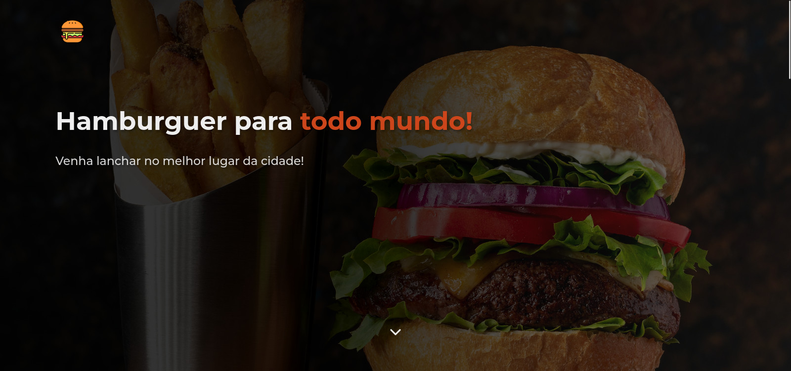
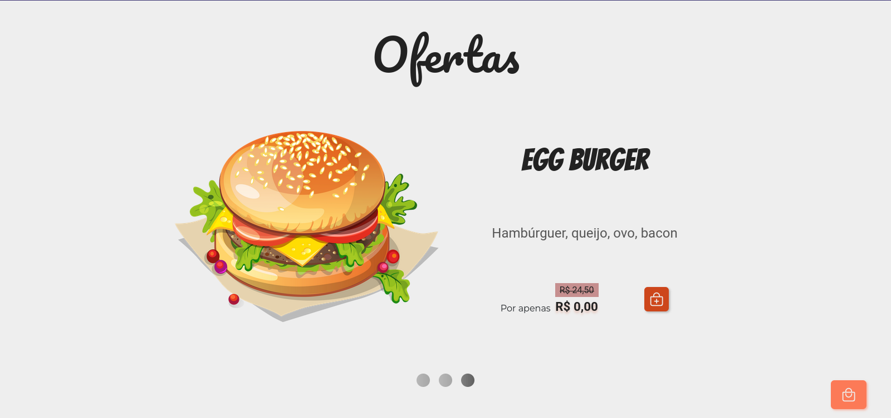
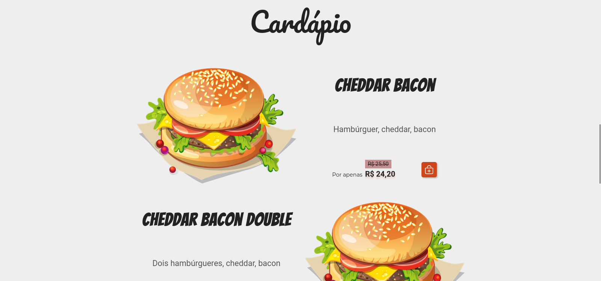
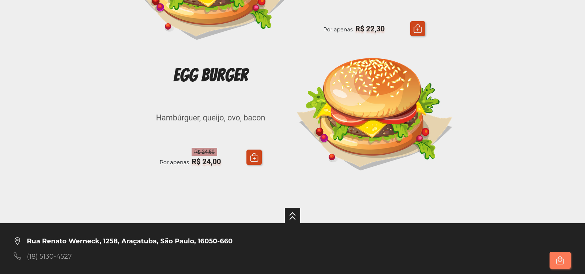
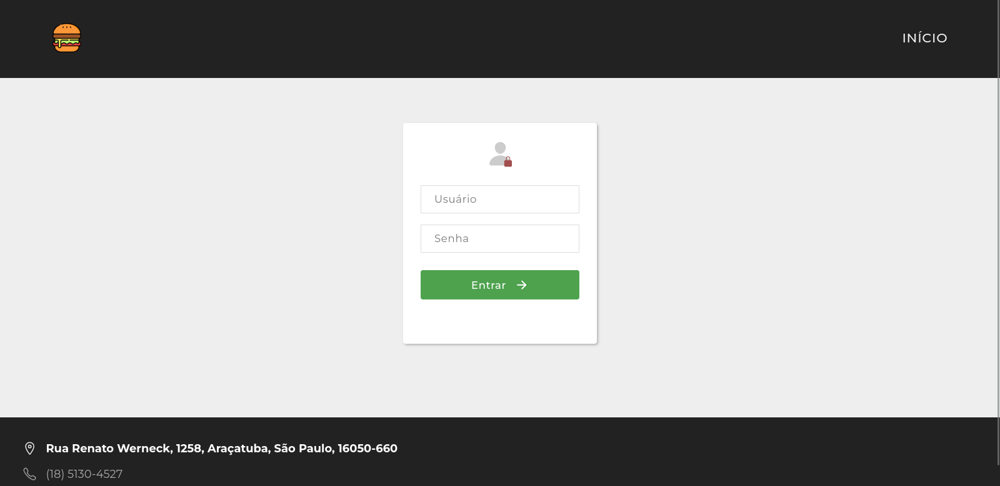
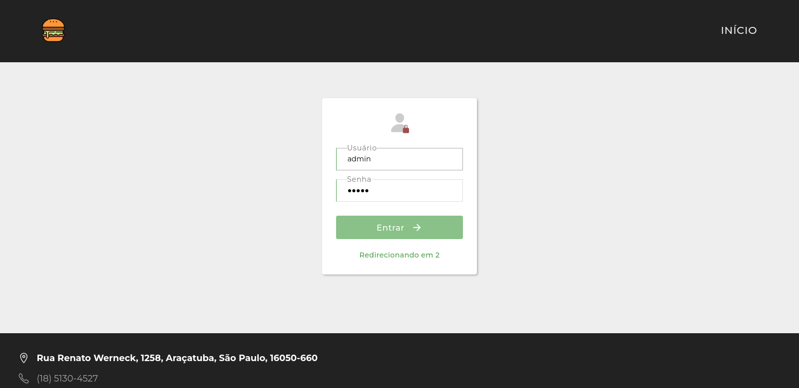
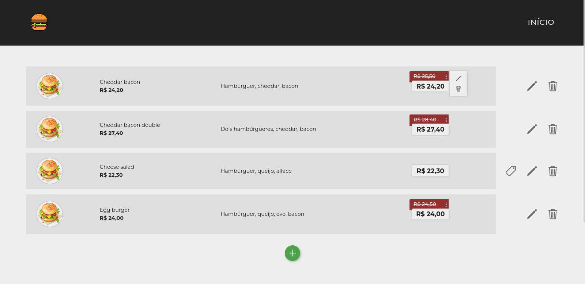

<h1 align="center">Snakz </h1>

<p align="center">Site de lanchonete fictícia feito para aprender C#</p>

<p align="center">
  
</p>

<h2 align="center">App showcase</h2>

<br />

<div style="display: inline-block;" align="center">
  
  
  
  
</div>

<br />

<h3 align="center">Área do admin</h3>

<br />

<div style="display: inline-block;" align="center">
  
  
  
</div>

<br />

<div align="center">
  <a href="https://insomnia.rest/run/?label=Snakz&uri=https%3A%2F%2Fraw.githubusercontent.com%2Fviniciusrodrigues1a%2Fsnakz%2Fmain%2FInsomnia_2022-07-14.json" target="_blank">
    
  </a>
</div>

<br />

## :page_facing_up: Índice

- [Sobre o projeto](#about)
- [Tecnologias e ferramentas](#built-using)
- [Rodando localmente](#running-locally)
- [Rodando testes](#running-tests)

<br />

## :monocle_face: Sobre o projeto <a name="about"></a>

Projeto para uma lanchonete fictícia, desenvolvido para aprimorar meus conhecimentos em C# e MVC.

<br />

## :hammer: Tecnologias e ferramentas <a name="built-using"></a>

<div style="display: inline-block;">
  
  
  
</div>

<br />

Desenvolvido utilizando **C#**, **.NET Core** e **React**.

<br />

## :computer: Rodando localmente <a name="running-locally"></a>

Clone o repositório

```bash
  git clone https://github.com/viniciusrodrigues1a/snakz
```

Vá à pasta WebApp/ no diretório do projeto

```bash
  cd snakz/WebApp/
```

Adicione as *user-secrets* da conta de admin

```bash
  dotnet user-secrets set "ADMIN_USERNAME" "admin"
  dotnet user-secrets set "ADMIN_PASSWORD" "admin"
```

Inicie a aplicação

```bash
  dotnet run
```

A aplicação estará rodando na url **http://localhost:5000/**

<br />

## :test_tube: Rodando testes <a name="running-tests"></a>

Na pasta raiz do projeto rode o comando de testes

```bash
  dotnet test
```
